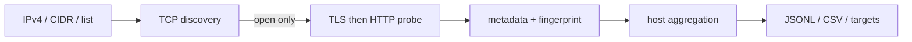

# Operator Surface Scanner

被疑C2 IPの **open TCP portだけ** を対象に、ポート番号へ依存せずHTTP/HTTPSの管理画面、ファイル配布面、未知Web surfaceを発見するRust製スキャナです。

## 実装範囲

- IPv4、単一IP、`IP:known_c2_port`、`IP,known_c2_port`、CIDR、ヘッダ付きCSV、ファイル、標準入力
- TCP connect backend（Windows/Linux/macOS）
- Linux raw SYN backend（SYN/ACK検証、RST追跡、重複抑制、timeout cleanup、retry、rate/burst、root/CAP_NET_RAW）
- bounded queue pipeline（target生成／TCP discovery／protocol probe／fingerprint／出力を別ステージで並行実行）
- 動的Tokio multi-thread runtimeと、target shard型multi-process coordinator
- TLS優先・plain HTTP fallback。80/443等のポート番号による決め打ちなし
- HTTP status/title/header/cookie名/body SHA-256/favicon SHA-256+mmh3/latency
- TLS version/cipher/ALPN/証明書/SPKI/SAN/期間/self-signed/IP SAN一致。**証明書検証は行わず、観測結果のみ記録**
- TLSは成立するがHTTPでないサービスも`protocol: "tls"`として証明書ごと保持
- HFS、directory listing、login/admin、Apache/nginx/IIS/Tomcat/Jetty/Node.js/Go等のheuristic fingerprint（個別ON/OFF可）
- unknown HTTP/HTTPSの保持、triage用suspicion score（重み設定可・根拠つき）
- 全出力レコードへの実行メタデータ付与
- host JSONL、service JSONL、CSV、URL/Nmap target、JSON metrics
- bounded concurrency、token bucket、timeout/retry、Ctrl+C、host単位checkpoint/resume
- TOML設定（CLIが優先）



## ビルド

Rust stableが必要です。Pythonはベンチマーク補助用で、本体の実行には不要です。

Windows PowerShell:

```powershell
.\scripts\build-windows.ps1
.\target\release\surface-scan.exe --help
```

Linux:

```bash
./scripts/build-linux.sh
./target/release/surface-scan --help
```

raw SYNを非rootで使う場合は、ビルド後に管理者が実行ファイルへ能力を付与できます。

```bash
sudo setcap cap_net_raw,cap_net_admin=eip ./target/release/surface-scan
getcap ./target/release/surface-scan
```

## 使用例

```powershell
# 単一IPまたはCIDR（connect mode）
surface-scan -p 1-65535 --scan-mode connect --concurrency 1024 192.0.2.10
surface-scan -p 80,443,8000-65535 192.0.2.0/24

# ファイル。IP:port または IP,port のportはknown C2 portとして記録される
surface-scan -i targets.txt -p 1-65535 -o result.jsonl --csv result.csv `
  --flat-output services.jsonl --export-urls urls.txt --export-nmap interesting.txt

# PowerShell stdin
Get-Content .\targets.txt | surface-scan - -p 1-65535

# Linux raw SYN
sudo surface-scan -i targets.txt -p 1-65535 --scan-mode syn --rate 50000 --burst 5000

# 16 threadを4 processへ配分して複数targetを並列走査
surface-scan -i targets.txt -p 1-65535 --worker-threads 16 --processes 4 `
  --checkpoint scan.mp.state -o result.jsonl
```

## オプション詳細

値を省略したときはTOML、TOMLにもなければ以下の既定値を使います。CLI指定は常にTOMLより優先されます。

### scan modeの違い

| 項目 | `--scan-mode connect` | `--scan-mode syn` |
|---|---|---|
| TCP discovery | OSの通常のTCP接続を最後まで確立 | raw socketでSYNを送信し、SYN/ACKまたはRST/ACKを直接判定 |
| 対応OS | Windows / Linux / macOS | Linuxのみ。rootまたは`CAP_NET_RAW`が必要 |
| 長所 | 権限不要で互換性が高く、ローカルfixtureや少数targetに向く | full-port・複数targetの高速discovery向け。接続を確立しないためsocket負荷を抑えやすい |
| 主な制約 | 大量の同時接続でFD・ephemeral port・OS TCP stackを消費 | firewall、packet loss、interface routingの影響を受ける。権限不足なら出力を開く前に終了 |
| `--rate` | 1秒あたりのconnection attempt数 | 1秒あたりの送信SYN packet数 |
| `--concurrency` | 同時に進行できるTCP socket数 | raw SYN backendではdiscovery上限としては使用しない |
| `--host-concurrency`既定 | 8 | 1。一つのraw senderで指定rateを使い切る設計 |
| retry | timeoutしたTCP connectを再試行 | 応答のないSYNを再送 |

どちらのmodeでも、application probeはTCP openと判定したportだけに対して「TLSを試し、成立しなければplain HTTP」を実行します。80/443などのport番号からprotocolを決め打ちしません。既定modeは`connect`です。

### 入力・基本設定

| オプション | 既定 | 説明 |
|---|---:|---|
| `TARGET` | なし | 単一IPv4、CIDR、`IP:known-port`を位置引数で指定。複数指定可能。`-`は標準入力 |
| `-i, --input PATH` | なし | target fileを読む。位置引数と併用した場合は両方を統合し、重複IPをscan前に除去 |
| `-p, --ports SPEC` | `1-65535` | `80,443,8000-9000`のように指定。重複portは除去。known C2 portは範囲外でも追加走査 |
| `--known-service-field NAME` | 自動候補 | header付きCSVでknown C2 portを持つ列名を明示。例: `c2_port` |
| `--config PATH` | なし | TOML設定を読む。未知keyや0 timeoutは誤設定として拒否 |
| `--scan-label TEXT` | なし | campaign名などを全JSON/CSVのmetadataへ記録。scan動作には影響しない |
| `--log-level FILTER` | `info` | tracing filter。例: `debug`、`surface_scan=debug`。大量scanで`trace`はI/O増加に注意 |

### TCP discovery・速度調整

| オプション | 既定 | 説明 |
|---|---:|---|
| `--scan-mode MODE` | `connect` | `connect`または`syn`。上表のbackendを選択 |
| `--rate N` | 10000 | token bucketの平均速度。connectではattempt/sec、synではpacket/sec。multi-processでも全子process合計値 |
| `--burst N` | 1000 | token bucketが瞬間的に許すattempt/SYN数。大きすぎる値は短時間の負荷集中を招く |
| `--concurrency N` | 1024 | connect modeの全host合計in-flight socket上限。rateとは別の上限で、先に達した側が速度を制限 |
| `--host-concurrency N` | connect: 8 / syn: 1 | TCP discoveryを同時進行するhost数。単一hostのport並列数ではない |
| `--tcp-timeout DURATION` | `700ms` | 1回のTCP attempt/SYN応答待ち期限。`700ms`、`1s`、単位なしのmsを指定可能 |
| `--tcp-retries N` | 1 | 初回失敗後の再試行回数。総試行上限は`1 + N`なので、probe数はport数を超える場合がある |

`--rate`を上げても、connect modeでは`--concurrency`やOSのFD上限、syn modeではNIC・kernel・packet lossが先に上限になる場合があります。timeoutとretryを小さくすると速くなりますが、filtered/遅延portの見逃しが増えます。

### protocol probe・pipeline

| オプション | 既定 | 説明 |
|---|---:|---|
| `--probe-concurrency N` | 128 | open portに対するTLS/HTTP probeの全host合計並列数 |
| `--fingerprint-concurrency N` | 32 | response metadata/body sampleを分類するworker数。ネットワーク接続数ではない |
| `--queue-depth N` | 64 | bounded pipeline各stageの待ち行列長。小さい値はmemoryを抑え、大きい値はstage間の揺らぎを吸収 |
| `--tls-timeout DURATION` | `1s` | TCP接続を含むTLS handshake期限。証明書検証は行わない |
| `--http-timeout DURATION` | `1s` | HTTP write/readの1回あたり無通信期限 |
| `--http-body-timeout DURATION` | `1500ms` | HTTP response全体のhard deadline。slow-drip responseもこの時間で打ち切る |
| `--max-body BYTES` | 262144 | hashing/fingerprint用にmemoryへ保持するbody上限。body自体は出力しない |
| `--worker-threads N` | 論理CPU数 | Tokio runtimeのthread総予算。multi-process時は子processへ分配 |
| `--processes N` | 1 | targetをround-robin分割する子process数（最大64）。単一target内部のportはprocess分割しない |

### 出力・再開

| オプション | 既定 | 説明 |
|---|---:|---|
| `-o, --output PATH` | `result.jsonl` | 主出力。1行1hostのJSONL。拡張子が`.json`でも内容はJSONL形式 |
| `--flat-output PATH` | なし | 1行1serviceのJSONL。Athena等でservice単位に扱う場合に使用 |
| `--csv PATH` | なし | 1行1serviceの分析用CSV |
| `--export-urls PATH` | なし | HTTP/HTTPS判定できたserviceをURLとして出力 |
| `--export-nmap PATH` | なし | HTTP/HTTPS判定できたserviceを`IP:port`形式で出力 |
| `--metrics-json PATH` | なし | 件数、stage時間、平均probe rate等をJSONで出力 |
| `--checkpoint PATH` | なし | host完了ごとにresume stateをatomic更新。multi-process時はcoordinator stateになる |
| `--resume PATH` | なし | checkpointから再開。target集合・port指定・schema・process数が一致しないstateは拒否 |

`--http-timeout` と `--http-body-timeout` は役割が違います。前者だけでは、タイムアウト未満の間隔でバイトを送り続けるサーバがprobeを無限に占有できてしまうため、後者でレスポンス全体を必ず打ち切ります。

`--processes`は複数targetをround-robinで分割します。単一IPのport範囲は分割しないため、process数はtarget数以下にしてください。`--rate`、`--burst`、connect socket数、protocol/fingerprint concurrency、`--worker-threads`は各子processへ均等配分され、全process合計が指定予算を超えないようにします。従ってprocess数を増やしただけで送信rateが意図せず倍増することはありません。各予算値はprocess数以上が必要です。

設定例は [`config.example.toml`](config.example.toml) を参照してください。CLI指定はTOMLより優先されます。

## 出力形式

host JSONLは1行1host、`schema_version: "2"`です。各レコードには`meta`ブロック（tool/version、`scan_id`、`scan_label`、scan mode、port指定、rate、各timeout、`tls_verification`、`target_set_hash`、実行OS）が入るため、S3に蓄積したあと実行時のコマンドラインを知らなくても解釈できます。`--flat-output`と`--metrics-json`にも同じ`meta`が入り、CSVには`scan_id`と`scan_started_at`列が入ります。同じIPの全serviceを`services`配列へ格納するため、C2 port、管理UI、file serverを関連付けたままS3へ保存し、AthenaのJSON処理で展開できます。`--flat-output`は1行1serviceです。秘密を保存しないため`Set-Cookie`はcookie名だけを出力し、値は`response_headers`にも残しません。本文そのものは保存せず、長さとSHA-256だけを保持します。

`unknown` TCPと、既知製品に一致しない`unknown_web`は異なります。後者は意図的に保持されます。suspicion scoreは悪性判定ではなく調査優先度です。高位ポートだけで悪性とは判定しません。

redirect先は記録しますが自動追跡しません（追跡回数0は設定上限内であり、別hostへの不要な通信を避けます）。faviconは検出済みWeb serviceに対する`GET /favicon.ico`の最大64 KiBを、Content-Typeとマジックバイトで実際にアイコンだと確認できた場合のみSHA-256とmmh3（Shodan互換）にします。`/favicon.ico`にHTMLを返すcatch-allサーバのページhashが混入することはありません。

HTTPSでは証明書検証を行いません（`meta.tls_verification: "skipped"`、`tls.verification_skipped: true`）。自己署名、期限切れ、hostname不一致はいずれもscanを止めず、`tls.self_signed` / `tls.validity` / `tls.hostname_match`として記録します。TLSは張れるがHTTPではないポートも、証明書を保持したまま`protocol: "tls"`として出力します。

`suspicion_score`には`suspicion_reasons`が併記され、加点根拠を後から監査できます。重みは設定ファイルの`[suspicion]`で変更できます。

## JSONLレポート生成

長いhost JSONLは、標準ライブラリだけで動く`render_report.py`を使って、単体HTMLとMarkdownへ変換できます。

```powershell
python scripts/render_report.py result/valleyrat_susp_c2.jsonl `
  --title "ValleyRAT Suspected C2 — Operator Surface Report"
```

既定の出力先:

```text
result/valleyrat_susp_c2.report.html
result/valleyrat_susp_c2.report.md
```

出力先を変更する場合:

```powershell
python scripts/render_report.py scan.jsonl `
  --html reports/scan.html --markdown reports/scan.md
```

HTMLレポートには以下を含みます。

- host/open service/Web/TLS/高score件数のKPI
- protocolとclassificationの分布chart
- score 6以上の優先確認キュー
- 同一body SHA-256とcertificate SHA-256の反復cluster
- IP、port、title、Server、body/certificate hashを横断する検索
- score、protocol、classification、Webのみ、未完了hostのfilter
- hostごとのopen service一覧と、加点根拠、HTTP、TLS、hash、error詳細
- desktop/mobile対応。外部CDN・外部通信なし

入力値はHTML escapeされ、reportを開いただけで対象endpointへ接続しません。endpointはcopy buttonで取得できます。反復hashは有用なpivotですが、共有hostingや既定error pageでも一致するため、同一operator/campaignの証明として単独使用しないでください。

## Checkpoint / resume

```bash
surface-scan -i targets.txt -p 1-65535 --checkpoint scan.state
surface-scan -i targets.txt -p 1-65535 --resume scan.state
```

Version 1のresume境界はhost単位です。target set hash、port指定、schema versionが一致しないcheckpointは拒否します。host JSONLはcheckpoint済みbyte位置へ戻し、CSV、service JSONL、URL/Nmap出力はそのhost JSONLから再生成するため、checkpoint更新直前に停止しても重複tailを残しません。入力、出力、metrics、checkpointに同じfile pathを指定した場合も起動前に拒否します。

multi-process時は指定checkpointがcoordinator stateになり、同名の`.parts`ディレクトリにprocess別manifest、host JSONL、metrics、checkpointを保持します。`--checkpoint`を省略した場合は`<output>.mp.state`を自動使用します。中断後は同じtarget、port、process数と`--resume <coordinator-state>`を指定してください。完了後も再現・監査用のpartsは保持されます。

Ctrl+C（WindowsではCtrl+Break、コンソール終了、ログオフ、UnixではSIGINT/SIGTERM）では新規投入を停止し、処理中の結果を回収してからflushとcheckpoint保存を行います。**走査を完走しなかったhostは`completed_hosts`に入らず、次回のresumeで再走査されます。** 部分結果自体は`scan.complete: false`付きで出力されるため、観測できた情報は失われません。2回目のシグナルで即時終了します。

## テスト

```powershell
cargo fmt --all -- --check
cargo test --all-targets
python -m unittest tests/test_render_report.py -v
```

統合テストはhigh-port HTTP（31337を優先）、high-port HTTPS（49152を優先）、自己署名証明書、favicon、directory/login classification、非HTTP TCPのnegative controlをローカルで起動します。固定portが使用中なら一時portへfallbackします。

Docker fixtureも利用できます。

```bash
docker compose -f tests/fixtures/compose.yml up -d
surface-scan -p 31337,49152,27331,28080,28443,29000 127.0.0.1
docker compose -f tests/fixtures/compose.yml down
```

Nmap比較（サービスversion比較ではなくdiscovery recallと時間の比較）:

```bash
python scripts/benchmark.py --scanner ./target/release/surface-scan `
  --target 192.0.2.10 --target 192.0.2.11 --ports 1-65535 `
  --processes 2 --worker-threads 8
```

`--target`は繰り返し指定できます。比較対象のNmapが利用可能なら、hostごとのopen port recallと差分もJSONへ記録します。process並列化の実効速度はtarget数、latency、OS/NICに依存するため、許可されたlabで同一条件の`--processes 1`と比較してください。

`psutil` が利用可能ならCPU時間とpeak RSSも記録し、Nmapのopen-port集合に対するrecallと差分をJSONで出力します。未導入でも経過時間とport差分の比較は実行できます。

## 検証境界

- Windows connect-mode: compile、unit/integration testで検証。遅延ドリップ、TLS非HTTP、非HTTP TCP、favicon catch-all、known C2 port、CSVヘッダ、中断時checkpointの各回帰テストを実測で通過
- Windows multi-process: 2 target × 2 processの子process起動、budget分割、JSONL/CSV/metrics統合、coordinator resume非重複をend-to-endで検証
- Linux raw SYN: Linux Docker + `CAP_NET_RAW`でSYN/ACK検出、closed判定、中断扱いの3件を実行済み。外部interfaceでのpacket loss/retry、10k/50k pps、70 IP × 65535の性能受け入れは環境依存で、専用labで別途確認が必要（**達成は未主張**）
- TLS証明書検証は意図的に行いません。エラーはscanを停止させずmetadataとして保持します。`self_signed`はissuer/subject一致によるheuristicです
- HTTP/2のみを話すエンドポイントはTLSメタデータまでを記録し、h2フレームは解析しません

spec.mdへの適合性レビューと修正内容は[`docs/REVIEW.md`](docs/REVIEW.md)、[`docs/REMEDIATION.md`](docs/REMEDIATION.md)にあります。

## 拡張

TCP discoveryは`ScannerBackend`、application層はasync `ProtocolProbe`、Web fingerprintは`Fingerprint` traitに分離しています。SSH/RDP/VNC等はscanner coreを変更せずprobe実装を追加できる境界です。
