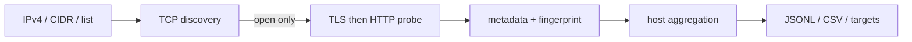

# Operator Surface Scanner

被疑C2 IPの **open TCP portだけ** を対象に、ポート番号へ依存せずHTTP/HTTPSの管理画面、ファイル配布面、未知Web surfaceを発見するRust製スキャナです。

## 実装範囲

- IPv4、単一IP、`IP:known_c2_port`、`IP,known_c2_port`、CIDR、ヘッダ付きCSV、ファイル、標準入力
- TCP connect backend（Windows/Linux/macOS）
- Linux raw SYN backend（SYN/ACK検証、RST追跡、重複抑制、timeout cleanup、retry、rate/burst、root/CAP_NET_RAW）
- bounded queue pipeline（target生成／TCP discovery／protocol probe／fingerprint／出力を別ステージで並行実行）
- TLS優先・plain HTTP fallback。80/443等のポート番号による決め打ちなし
- HTTP status/title/header/cookie名/body SHA-256/favicon SHA-256+mmh3/latency
- TLS version/cipher/ALPN/証明書/SPKI/SAN/期間/self-signed/IP SAN一致。**証明書検証は行わず、観測結果のみ記録**
- TLSは成立するがHTTPでないサービスも`protocol: "tls"`として証明書ごと保持
- HFS、directory listing、login/admin、Apache/nginx/IIS/Tomcat/Jetty/Node.js/Go等のheuristic fingerprint（個別ON/OFF可）
- unknown HTTP/HTTPSの保持、triage用suspicion score（重み設定可・根拠つき）
- 全出力レコードへの実行メタデータ付与
- host JSONL、service JSONL、CSV、URL/Nmap target、JSON metrics
- bounded concurrency、token bucket、timeout/retry、Ctrl+C、host単位checkpoint/resume
- TOML設定（CLIが優先）



## ビルド

Rust stableが必要です。Pythonはベンチマーク補助用で、本体の実行には不要です。

Windows PowerShell:

```powershell
.\scripts\build-windows.ps1
.\target\release\surface-scan.exe --help
```

Linux:

```bash
./scripts/build-linux.sh
./target/release/surface-scan --help
```

raw SYNを非rootで使う場合は、ビルド後に管理者が実行ファイルへ能力を付与できます。

```bash
sudo setcap cap_net_raw,cap_net_admin=eip ./target/release/surface-scan
getcap ./target/release/surface-scan
```

## 使用例

```powershell
# 単一IPまたはCIDR（connect mode）
surface-scan -p 1-65535 --scan-mode connect --concurrency 1024 192.0.2.10
surface-scan -p 80,443,8000-65535 192.0.2.0/24

# ファイル。IP:port または IP,port のportはknown C2 portとして記録される
surface-scan -i targets.txt -p 1-65535 -o result.jsonl --csv result.csv `
  --flat-output services.jsonl --export-urls urls.txt --export-nmap interesting.txt

# PowerShell stdin
Get-Content .\targets.txt | surface-scan - -p 1-65535

# Linux raw SYN
sudo surface-scan -i targets.txt -p 1-65535 --scan-mode syn --rate 50000 --burst 5000
```

主な調整値:

```text
--rate 10000              connection attempts/sec または SYN packets/sec（プロセス全体）
--burst 1000
--concurrency 1024        connect socket上限（プロセス全体）
--probe-concurrency 128   application probe上限（プロセス全体）
--fingerprint-concurrency 32 fingerprint worker上限（プロセス全体）
--host-concurrency 8      並行discovery host数（synの既定は1）
--queue-depth 64          各pipeline stageのキュー深度
--tcp-timeout 700ms --tcp-retries 1
--tls-timeout 1s
--http-timeout 1s         1回のread無通信タイムアウト
--http-body-timeout 1500ms レスポンス全体の期限
--max-body 262144
--known-service-field c2_port   CSVのknown C2 port列名
--scan-label campaign-2026-08   出力metaへ刻むラベル
```

`--http-timeout` と `--http-body-timeout` は役割が違います。前者だけでは、タイムアウト未満の間隔でバイトを送り続けるサーバがprobeを無限に占有できてしまうため、後者でレスポンス全体を必ず打ち切ります。

設定例は [`config.example.toml`](config.example.toml) を参照してください。CLI指定はTOMLより優先されます。

## 出力形式

host JSONLは1行1host、`schema_version: "2"`です。各レコードには`meta`ブロック（tool/version、`scan_id`、`scan_label`、scan mode、port指定、rate、各timeout、`tls_verification`、`target_set_hash`、実行OS）が入るため、S3に蓄積したあと実行時のコマンドラインを知らなくても解釈できます。`--flat-output`と`--metrics-json`にも同じ`meta`が入り、CSVには`scan_id`と`scan_started_at`列が入ります。同じIPの全serviceを`services`配列へ格納するため、C2 port、管理UI、file serverを関連付けたままS3へ保存し、AthenaのJSON処理で展開できます。`--flat-output`は1行1serviceです。秘密を保存しないため`Set-Cookie`はcookie名だけを出力し、値は`response_headers`にも残しません。本文そのものは保存せず、長さとSHA-256だけを保持します。

`unknown` TCPと、既知製品に一致しない`unknown_web`は異なります。後者は意図的に保持されます。suspicion scoreは悪性判定ではなく調査優先度です。高位ポートだけで悪性とは判定しません。

redirect先は記録しますが自動追跡しません（追跡回数0は設定上限内であり、別hostへの不要な通信を避けます）。faviconは検出済みWeb serviceに対する`GET /favicon.ico`の最大64 KiBを、Content-Typeとマジックバイトで実際にアイコンだと確認できた場合のみSHA-256とmmh3（Shodan互換）にします。`/favicon.ico`にHTMLを返すcatch-allサーバのページhashが混入することはありません。

HTTPSでは証明書検証を行いません（`meta.tls_verification: "skipped"`、`tls.verification_skipped: true`）。自己署名、期限切れ、hostname不一致はいずれもscanを止めず、`tls.self_signed` / `tls.validity` / `tls.hostname_match`として記録します。TLSは張れるがHTTPではないポートも、証明書を保持したまま`protocol: "tls"`として出力します。

`suspicion_score`には`suspicion_reasons`が併記され、加点根拠を後から監査できます。重みは設定ファイルの`[suspicion]`で変更できます。

## Checkpoint / resume

```bash
surface-scan -i targets.txt -p 1-65535 --checkpoint scan.state
surface-scan -i targets.txt -p 1-65535 --resume scan.state
```

Version 1のresume境界はhost単位です。target set hash、port指定、schema versionが一致しないcheckpointは拒否します。host JSONLはcheckpoint済みbyte位置へ戻し、CSV、service JSONL、URL/Nmap出力はそのhost JSONLから再生成するため、checkpoint更新直前に停止しても重複tailを残しません。入力、出力、metrics、checkpointに同じfile pathを指定した場合も起動前に拒否します。

Ctrl+C（WindowsではCtrl+Break、コンソール終了、ログオフ、UnixではSIGINT/SIGTERM）では新規投入を停止し、処理中の結果を回収してからflushとcheckpoint保存を行います。**走査を完走しなかったhostは`completed_hosts`に入らず、次回のresumeで再走査されます。** 部分結果自体は`scan.complete: false`付きで出力されるため、観測できた情報は失われません。2回目のシグナルで即時終了します。

## テスト

```powershell
cargo fmt --all -- --check
cargo test --all-targets
```

統合テストはhigh-port HTTP（31337を優先）、high-port HTTPS（49152を優先）、自己署名証明書、favicon、directory/login classification、非HTTP TCPのnegative controlをローカルで起動します。固定portが使用中なら一時portへfallbackします。

Docker fixtureも利用できます。

```bash
docker compose -f tests/fixtures/compose.yml up -d
surface-scan -p 31337,49152,27331,28080,28443,29000 127.0.0.1
docker compose -f tests/fixtures/compose.yml down
```

Nmap比較（サービスversion比較ではなくdiscovery recallと時間の比較）:

```bash
python scripts/benchmark.py --scanner ./target/release/surface-scan --target 127.0.0.1 --ports 1-65535
```

`psutil` が利用可能ならCPU時間とpeak RSSも記録し、Nmapのopen-port集合に対するrecallと差分をJSONで出力します。未導入でも経過時間とport差分の比較は実行できます。

## 検証境界

- Windows connect-mode: compile、unit/integration testで検証。遅延ドリップ、TLS非HTTP、非HTTP TCP、favicon catch-all、known C2 port、CSVヘッダ、中断時checkpointの各回帰テストを実測で通過
- Linux raw SYN: Linux Docker + `CAP_NET_RAW`でSYN/ACK検出、closed判定、中断扱いの3件を実行済み。外部interfaceでのpacket loss/retry、10k/50k pps、70 IP × 65535の性能受け入れは環境依存で、専用labで別途確認が必要（**達成は未主張**）
- TLS証明書検証は意図的に行いません。エラーはscanを停止させずmetadataとして保持します。`self_signed`はissuer/subject一致によるheuristicです
- HTTP/2のみを話すエンドポイントはTLSメタデータまでを記録し、h2フレームは解析しません

spec.mdへの適合性レビューと修正内容は[`docs/REVIEW.md`](docs/REVIEW.md)、[`docs/REMEDIATION.md`](docs/REMEDIATION.md)にあります。

## 拡張

TCP discoveryは`ScannerBackend`、application層はasync `ProtocolProbe`、Web fingerprintは`Fingerprint` traitに分離しています。SSH/RDP/VNC等はscanner coreを変更せずprobe実装を追加できる境界です。
