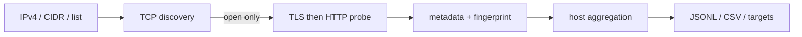

# Operator Surface Scanner

被疑C2 IPの **open TCP portだけ** を対象に、ポート番号へ依存せずHTTP/HTTPSの管理画面、ファイル配布面、未知Web surfaceを発見するRust製スキャナです。Nmapを置き換えるサービス列挙器ではなく、Nmap/Nuclei/ブラウザへ渡す候補を高速に絞る用途に特化しています。

## 実装範囲

- IPv4、単一IP、`IP:known_c2_port`、`IP,known_c2_port`、CIDR、ファイル、標準入力
- TCP connect backend（Windows/Linux/macOS）
- Linux raw SYN backend（SYN/ACK検証、重複抑制、retry、rate/burst、RST、root/CAP_NET_RAW）
- TLS優先・plain HTTP fallback。80/443等のポート番号による決め打ちなし
- HTTP status/title/header/cookie名/body SHA-256/favicon SHA-256/latency
- TLS version/cipher/ALPN/証明書/SAN/期間/self-signed/IP SAN一致
- HFS、directory listing、login/admin、Apache/nginx/IIS/Tomcat/Jetty/Node.js/Go等のheuristic fingerprint
- unknown HTTP/HTTPSの保持、triage用suspicion score
- host JSONL、service JSONL、CSV、URL/Nmap target、JSON metrics
- bounded concurrency、token bucket、timeout/retry、Ctrl+C、host単位checkpoint/resume
- TOML設定（CLIが優先）



## ビルド

Rust stableが必要です。Pythonはベンチマーク補助用で、本体の実行には不要です。

Windows PowerShell:

```powershell
.\scripts\build-windows.ps1
.\target\release\surface-scan.exe --help
```

Linux:

```bash
./scripts/build-linux.sh
./target/release/surface-scan --help
```

raw SYNを非rootで使う場合は、ビルド後に管理者が実行ファイルへ能力を付与できます。

```bash
sudo setcap cap_net_raw,cap_net_admin=eip ./target/release/surface-scan
getcap ./target/release/surface-scan
```

## 使用例

```powershell
# 単一IPまたはCIDR（connect mode）
surface-scan -p 1-65535 --scan-mode connect --concurrency 1024 192.0.2.10
surface-scan -p 80,443,8000-65535 192.0.2.0/24

# ファイル。IP:port または IP,port のportはknown C2 portとして記録される
surface-scan -i targets.txt -p 1-65535 -o result.jsonl --csv result.csv `
  --flat-output services.jsonl --export-urls urls.txt --export-nmap interesting.txt

# PowerShell stdin
Get-Content .\targets.txt | surface-scan - -p 1-65535

# Linux raw SYN
sudo surface-scan -i targets.txt -p 1-65535 --scan-mode syn --rate 50000 --burst 5000
```

主な調整値:

```text
--rate 10000              connection attempts/sec または SYN packets/sec
--burst 1000
--concurrency 1024        connect socket上限
--probe-concurrency 128   application probe上限
--tcp-timeout 700ms --tcp-retries 1
--tls-timeout 1s --http-timeout 1s
--max-body 262144
```

設定例は [`config.example.toml`](config.example.toml) を参照してください。CLI指定はTOMLより優先されます。

## 出力契約

host JSONLは1行1host、`schema_version: "1"`です。同じIPの全serviceを`services`配列へ格納するため、C2 port、管理UI、file serverを関連付けたままS3へ保存し、AthenaのJSON処理で展開できます。`--flat-output`は1行1serviceです。秘密を保存しないため`Set-Cookie`はcookie名だけを出力し、値は`response_headers`にも残しません。本文そのものは保存せず、長さとSHA-256だけを保持します。

`unknown` TCPと、既知製品に一致しない`unknown_web`は異なります。後者は意図的に保持されます。suspicion scoreは悪性判定ではなく調査優先度です。高位ポートだけで悪性とは判定しません。

redirect先は記録しますが自動追跡しません（追跡回数0は設定上限内であり、別hostへの不要な通信を避けます）。faviconは検出済みWeb serviceに対する`GET /favicon.ico`の最大64 KiBをSHA-256化します。

## Checkpoint / resume

```bash
surface-scan -i targets.txt -p 1-65535 --checkpoint scan.state
surface-scan -i targets.txt -p 1-65535 --resume scan.state
```

Version 1のresume境界はhost単位です。target set hashとport指定が一致しないcheckpointは拒否します。Ctrl+Cでは新規投入を停止し、処理済みhostの出力をflushしてcheckpointを保存します。中断時に走査中だったhostは次回再走査されます。

## テスト

```powershell
cargo fmt --all -- --check
cargo test --all-targets
```

統合テストはhigh-port HTTP（31337を優先）、high-port HTTPS（49152を優先）、自己署名証明書、favicon、directory/login classification、非HTTP TCPのnegative controlをローカルで起動します。固定portが使用中なら一時portへfallbackします。

Docker fixtureも利用できます。

```bash
docker compose -f tests/fixtures/compose.yml up -d
surface-scan -p 31337,49152,27331,28080,28443,29000 127.0.0.1
docker compose -f tests/fixtures/compose.yml down
```

Nmap比較（サービスversion比較ではなくdiscovery recallと時間の比較）:

```bash
python scripts/benchmark.py --scanner ./target/release/surface-scan --target 127.0.0.1 --ports 1-65535
```

## 検証境界

- Windows connect-mode: compile、unit/integration testで検証
- Linux raw SYN: Linuxコンテナの`CAP_NET_RAW`付きloopbackでSYN/ACK検出まで検証済み。外部interfaceでのpacket loss/retry、10k/50k pps、70 IP × 65535の性能受け入れは環境依存で、専用labで別途確認が必要
- TLS証明書検証エラーはscanを停止させずmetadataとして保持します。`self_signed`はissuer/subject一致によるheuristicです

## 拡張

TCP discoveryは`ScannerBackend`、application層はasync `ProtocolProbe`、Web fingerprintは`Fingerprint` traitに分離しています。SSH/RDP/VNC等はscanner coreを変更せずprobe実装を追加できる境界です。
